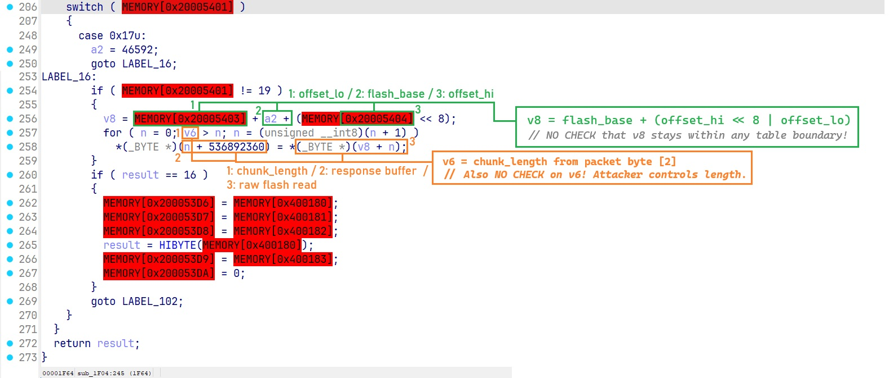

## Acknowledgements

Protocol information for the AK680 MAX (no-RGB) variant was initially derived from [not-ajazz-ak680-max-webhid](https://github.com/somenever/not-ajazz-ak680-max-webhid) by someever (GPL-3.0). The RGB model protocol was independently reverse-engineered.
All code in this repository is written from scratch, still the Author should be noted here.


## 1. Background and Objectives

### 1.1. Hardware Variants

The AJAZZ AK680 MAX keyboard is sold under a single product name but ships in two hardware variants with incompatible firmware and communication protocols:

- **Lightless (no-RGB)**: VID `0x3151`, PID `0x502C`, usage page `0xFFFF`. Communicates via 64-byte HID feature reports. Every outgoing report carries an 8-byte header whose last byte is a checksum computed as `0xFF - (sum of preceding 7 header bytes)`. The full key-configuration protocol (actuation, rapid trigger, layers) was documented in an open-source Svelte/WebHID utility by the GitHub user `somenever`. That utility was the starting point for this project.

- **RGB**: VID `0x0C45`, PID `0x80B2`. Exposes multiple HID collections across four USB interfaces. The protocol was entirely undocumented. The Svelte source contained a `KeyboardDriver` object for RGB models (`AK680_DRIVER` in `ak680.ts`) where `getKeys`, `applyKeys`, `getLayer`, and `setLayer` all threw `throw new Error("Function not implemented.")`. Only `createDriverState` was implemented, which sent a single `GetDeviceInfo` command (command byte `0x10`) and parsed the response. The author had not reverse-engineered the configuration protocol for the RGB variant.

### 1.2. Objective

Build a native Windows driver application in Rust (using `egui` for GUI and `hidapi` for HID communication) that can read and write per-key actuation points, per-key RGB colors, and LED effects on the RGB model. The Svelte application's lightless protocol implementation was used as architectural reference, but the RGB protocol had to be discovered from scratch.

### 1.3. Why Not Use the Official Software

The official Ajazz configuration software is a WebHID application hosted at `https://ajazz.driveall.cn`. It requires a Chromium-based browser. I did not have Chrome installed. Microsoft Edge was eventually used for traffic interception (Section 8), but the goal remained a standalone native application that does not require a browser.

A secondary configuration site, `https://qmk.top`, was investigated but does not support the AK680 MAX RGB model. The Ajazz-hosted site was the only known working configurator.

---

## 2. HID Interface Enumeration

### 2.1. Initial Device Discovery

The `hidapi` crate's `device_list()` method enumerates all HID interfaces exposed by the operating system. For the AK680 MAX RGB, connected via USB, Windows reported 7 HID interface descriptors across 4 USB interfaces:

```
iface=0  page=0x0001  usage=0x0006  "AJAZZ AK680 MAX"   Standard keyboard
iface=1  page=0x000C  usage=0x0001  "AJAZZ AK680 MAX"   Consumer control
iface=1  page=0x0001  usage=0x0080  "AJAZZ AK680 MAX"   System control
iface=1  page=0x0001  usage=0x0006  "AJAZZ AK680 MAX"   Keyboard (composite)
iface=1  page=0x0001  usage=0x0002  "AJAZZ AK680 MAX"   Mouse (composite)
iface=2  page=0xFF68  usage=0x0061  "AJAZZ AK680 MAX"   Vendor-specific
iface=3  page=0xFF67  usage=0x0061  "AJAZZ AK680 MAX"   Vendor-specific
```

Interfaces 0 and 1 handle standard HID keyboard/mouse/consumer input and are not relevant to configuration. Interfaces 2 and 3 are vendor-specific and were the candidates for configuration commands.

### 2.2. Which Interface to Target

The original Svelte source defined the RGB model's configuration as:

```javascript
const AK680_DRIVER: KeyboardDriver<DriverState> = {
    // ...
};
const createAK680Config = (options) => ({
    vendorId: 3141,        // 0x0C45
    usagePage: 65383,      // 0xFF67
    // ...
});
```

This pointed to usage page `0xFF67` (interface 3). However, as documented in Section 3, interface 3 turned out to be non-functional for command-response communication. The actual configuration endpoint is interface 2 (`0xFF68`), which was discovered empirically through transport probing.

---

## 3. Transport Layer Discovery and Failures

### 3.1. First Attempt -- Interface 3 via hidapi write()

The driver initially attempted to open interface 3 (matching the Svelte source's `usagePage: 0xFF67`) and send a `GetDeviceInfo` command via `hidapi::HidDevice::write()`:

```rust
let mut buf = [0u8; 33]; // report ID + 32 bytes (wrong size, see Section 4)
buf[0] = 0x00;
buf[1] = 0xAA; // magic
buf[2] = 0x10; // GetDeviceInfo
buf[3] = 0x18; // length = 24
device.write(&buf)?;
```

The result:

```
hidapi error: hid_write/WaitForSingleObject: (0x000003E5)
```

Windows error `0x3E5` = `ERROR_IO_PENDING`. `hidapi::write()` internally calls `WriteFile()` targeting the interrupt OUT endpoint. Interface 3's HID descriptor does not declare a functional interrupt OUT endpoint (or declares one that the firmware never services), causing the overlapped I/O operation to pend indefinitely until the internal timeout fires.

### 3.2. Adaptive Transport Probe

To handle the possibility that different interfaces require different HID API calls, an adaptive transport probing mechanism was implemented. Three transport strategies were defined:

```rust
enum Transport {
    OutputReport,       // write() + read_timeout()
    MixedFeatureWrite,  // send_feature_report() + read_timeout()
    FeatureReport,      // send_feature_report() + get_feature_report()
}
```

Each strategy was tried in order by sending a `GetDeviceInfo` request and waiting for a response. On interface 3:

| Strategy | Send Result | Receive Result |
|---|---|---|
| `OutputReport` | `ERROR_IO_PENDING` (0x3E5) | Not attempted |
| `MixedFeatureWrite` | Success | `ERROR_GEN_FAILURE` (0x6F8): "The existing buffer is not suitable" |
| `FeatureReport` | Success | `ERROR_INVALID_PARAMETER` (0x57) |

`MixedFeatureWrite` succeeded on the send side -- `HidD_SetFeature()` (called by `send_feature_report()`) works on interface 3 because the HID descriptor declares a 65-byte feature report. However, `ReadFile()` (called by `read_timeout()`) failed because the read buffer size (33 bytes, initially) did not match the declared report size, and interface 3 has no interrupt IN endpoint anyway (`Input Report Size: 0 bytes`, see Section 3.4).

`FeatureReport` also failed on receive because `HidD_GetFeatureReport()` with a 33-byte buffer did not match the 65-byte feature report declared in the descriptor.

### 3.3. Interface 2 -- Success

The probe was extended to iterate over all vendor-specific interfaces (usage page >= `0xFF00`) sorted by interface number. Interface 2 (`0xFF68`) was tried first:

```
Trying RGB: page=0xFF68 usage=0x0061 iface=2
Probing transport: OutputReport (write + read) ...
  Transport OutputReport (write + read) works!
```

`hidapi::write()` succeeded (interface 2 has a functional interrupt OUT endpoint), and `hidapi::read_timeout()` returned a valid response within 150ms. The response started with magic byte `0x55` and command byte `0x10`, confirming bidirectional communication.

```
TX: AA 10 18 00 00 00 00 00  [24 zero bytes]
RX: 55 10 18 00 00 00 00 00  00 00 00 92 45 0C B2 80  06 01 00 00 66 01 04 15
```

From this point forward, all communication used interface 2 with `OutputReport` transport.

### 3.4. Interface 3 -- HID Descriptor Deep Dive (Windows API)

To understand why interface 3 behaved so erratically, direct Windows HID API calls were used to query the HID preparsed data:

```rust
extern "system" {
    fn HidD_GetPreparsedData(handle: HANDLE, preparsed: *mut isize) -> i32;
    fn HidP_GetCaps(preparsed: isize, caps: *mut HidPCaps) -> i32;
}
```

Results for interface 3:

```
Usage:                0x0061
Usage Page:           0xFF67
Input Report Size:    0 bytes      <-- no input reports at all
Output Report Size:   4097 bytes   <-- 4KB + 1 (report ID), likely firmware update endpoint
Feature Report Size:  65 bytes     <-- 64 data + 1 report ID
```

The 4097-byte output report is characteristic of a firmware update channel. The 65-byte feature report buffer on interface 3 was verified to be a simple read-write buffer with no firmware processing:

```
TX (HidD_SetFeature):  AA E5 18 00 00 00 01 00 ...
RX (HidD_GetFeature):  AA E5 18 00 00 00 01 00 ...  // exact echo, no 0x55 magic
```

The firmware stores whatever bytes are written via `SetFeature` and returns them verbatim via `GetFeature`. No command processing occurs. Interface 3's feature reports are either unused or serve as a general-purpose scratchpad for the firmware update process.

### 3.5. Cross-Interface Communication Test

One hypothesis was that the firmware routes commands sent to interface 3 and returns responses on interface 2 (or vice versa). This was tested by opening both interfaces simultaneously:

```rust
// Send on interface 3 via feature report
writer.send_feature_report(&buf)?;
// Read from interface 2 via interrupt IN
let n = reader.read_timeout(&mut recv_buf, 2000)?;
```

Result: no data arrived on interface 2 within 2 seconds. The interfaces are fully isolated; firmware does not bridge between them.

---

## 4. Command Scan -- The 32-Byte Mistake

### 4.1. Initial Scan Architecture

A probe binary (`ak680-probe`) was built alongside the main driver to send arbitrary HID commands and observe responses. The initial implementation constructed 32-byte reports (matching the lightless model's `REPORT_SIZE = 32` from the Svelte source):

```rust
fn build_probe_packet(cmd: u8) -> [u8; 32] {
    let mut report = [0u8; 32];
    report[0] = 0xAA;  // magic
    report[1] = cmd;
    report[2] = 24;    // DATA_SIZE = 32 - 8
    report
}
```

### 4.2. Full Scan Results (0x00 through 0x64)

A scan of command IDs `0x00` through `0xFF` was attempted. Commands `0x00` through `0x64` all responded (86 total before the keyboard froze). However, the responses fell into only three categories:

**Category 1 -- DeviceInfo (command `0x10`):**
```
55 10 18 00 00 00 00 00  00 00 00 92 45 0C B2 80  06 01 00 00 66 01 04 15
```

Non-zero data in the payload. BCD-encoded firmware version, VID/PID echo, battery level, etc.

**Category 2 -- Config register (command `0x13`):**
```
55 13 18 00 00 00 00 00  0B FF FF FF 00 00 00 00  01 00 00 00 00 00 00 00
```

Static data: `0x0B` (11, likely feature/key-group count), `FF FF FF` (24-bit capability mask, all enabled), `0x01` at offset 16 (current mode or layer). This data was identical regardless of offset, sub-command, or any other parameter variation.

**Category 3 -- Empty ACK (all other commands):**
```
55 XX 18 00 00 00 00 00  00 00 00 00 00 00 00 00  00 00 00 00 00 00 00 00
```

The firmware echoed the command byte at position [1] and returned 24 zero bytes as payload. No key configuration data, no error indication, just emptiness.

### 4.3. The Freeze at Command 0x64

Somewhere in the range `0x50`-`0x64`, the firmware entered an unresponsive state. After command `0x64` was acknowledged, all subsequent commands failed:

```
[0x64] << 55 64 18 00 00 ...      (last valid response)
[0x65] !! ERROR: WriteFile: (0x000001B1) Device does not exist
```

Error `0x1B1` = `ERROR_DEV_NOT_EXIST`. The USB device had logically disconnected. Later attempts produced `0x48F` = `ERROR_DEVICE_NOT_CONNECTED`. The keyboard required a physical USB replug to recover. All keys and RGB LEDs remained frozen in their last state during this lockup.

This behavior strongly suggested that some commands in the 0x50-0x64 range have side effects (possibly writing to flash, entering a calibration mode, or initiating a firmware update handshake) but require specific payload data to complete properly. Our 32-byte packets with 24 zero bytes of payload were not valid commands and left the firmware in an undefined state.

### 4.4. Deep Probing of Command 0x13

Since `0x13` was the only command besides `0x10` that returned non-zero data, exhaustive parameter sweeps were performed:

- `deep 13 5` (vary header byte [5], sub-command): all 256 values returned identical `0B FF FF FF ... 01` data. The sub-command byte was echoed in the response header but had no effect on data.
- `deep 13 3` (vary offset low byte): all 256 values returned identical data. Offset was echoed but ignored.
- `deep 13 4` (vary offset high byte): same result.
- `read 13 00 8` (multi-chunk read, 8 chunks with increasing offset): all chunks returned identical data.
- `watch 13 200` (poll every 200ms while pressing keys): data never changed.

Conclusion: command `0x13` returns a fixed configuration register from SRAM, not a paged memory region. It reports device capabilities and current mode but contains no per-key data.

**Note:** This conclusion was partially incorrect. The register was returning truncated data because of the 32-byte packet size (see Section 5.4). With correct 64-byte packets and the `sub=0x01` flag, CMD `0x13` returns a live LED state register that updates in real time (see Section 10).

### 4.5. Silent Zones

Commands `0x19`-`0x20` and `0x29`-`0x2F` produced no response at all (timeout after 150ms). These command IDs fall in gaps between the read group (`0x10`-`0x18`) and write group (`0x20`-`0x28`). They are likely unimplemented in the firmware and silently discarded.

Probing these silent zones with payload data also produced no response:

```
ak680-probe send AA190018000000000100000000000000000000000000000000000000000000000000
RX << (timeout)
```

---

## 5. Breakthrough -- Traffic Interception via WebHID

### 5.1. The Ajazz Online Driver

The official Ajazz keyboard configuration software is hosted at `https://ajazz.driveall.cn`. It is a single-page web application that uses the WebHID API to communicate with USB HID devices directly from the browser. It supports the AK680 MAX RGB model and can configure actuation points, rapid trigger, per-key RGB, and other settings.

### 5.2. JavaScript Interceptor

Since I already had Microsoft Edge installed (which supports WebHID), a JavaScript interceptor was injected into the browser's DevTools console **before** connecting the keyboard. The interceptor monkey-patched every HID-related method on the `HIDDevice` object to log all traffic:

```javascript
device.sendReport = async function(reportId, data) {
    const arr = new Uint8Array(data);
    log.push({ ts: Date.now(), dir: 'OUT', type: 'report', reportId, data: [...arr] });
    console.log('[HID] sendReport:', reportId, hexDump(arr));
    return origSendReport(reportId, data);
};

device.addEventListener = function(type, handler, opts) {
    if (type === 'inputreport') {
        const wrappedHandler = (e) => {
            const arr = new Uint8Array(e.data.buffer);
            log.push({ ts: Date.now(), dir: 'IN', type: 'inputreport', data: [...arr] });
            console.log('[HID] inputreport:', hexDump(arr));
            handler(e);
        };
        return origAddEventListener(type, wrappedHandler, opts);
    }
    return origAddEventListener(type, handler, opts);
};
```

Utility functions `dumpHidLog()` and `saveHidLog()` were exposed globally to extract the captured traffic as JSON or to the console.

### 5.3. Connection Observations

Upon connecting the keyboard through the Ajazz website, the interceptor logged:

```
[HID] open: AJAZZ AK680 MAX VID: 0x0c45 PID: 0x80b2
  collection[0]: page=0xff68 usage=0x0061
```

The Ajazz software selected **interface 2** (`0xFF68`), not interface 3 (`0xFF67`). This confirmed our empirical finding from Section 3.3.

The website also logged a configuration file lookup:

```
Found config: /src/config/keyboards/ajazz/3141-32946-AJAZZ AK680 MAX.ts
```

### 5.4. The 64-Byte Revelation

The first command sent by the Ajazz software was `GetDeviceInfo`:

```
[HID] sendReport: 0 aa 10 30 00 00 00 01 00
  00 00 00 00 00 00 00 00 00 00 00 00 00 00 00 00
  00 00 00 00 00 00 00 00 00 00 00 00 00 00 00 00
  00 00 00 00 00 00 00 00 00 00 00 00 00 00 00 00 00
```

This is **64 bytes of data** (65 on wire including report ID 0), not 32. The length field is `0x30` (48 bytes of payload requested), not `0x18` (24). The data chunk area is 56 bytes (`0x38`), not 24.

The Svelte source's `REPORT_SIZE = 32` was the correct size for the **lightless** model's interrupt reports. The RGB model uses 64-byte interrupt reports. The WebHID implementation in the Svelte project simply had the wrong constant -- or rather, the code for the RGB driver had been started with lightless constants and was never corrected because the RGB `getKeys`/`applyKeys` were never implemented.

This single discovery explained why the probe scan in Section 4 produced only empty ACKs: the firmware received 32-byte reports with 24 bytes of payload, found the data insufficient or malformed, and returned empty acknowledgements without processing the command. The firmware did not return an error code -- it simply echoed the command byte with zero data.

### 5.5. Connection Phase Traffic

The full connection sequence captured from the Ajazz software:

| # | Direction | CMD | Len | Offset | Notes |
|---|---|---|---|---|---|
| 1 | OUT | `0x10` | `0x30` | `0x0000` | GetDeviceInfo, sub=0x01 |
| 2 | IN | `0x10` | `0x30` | `0x0000` | DeviceInfo response |
| 3-4 | OUT/IN | `0x11` | `0x38` | `0x0000` | Read device config, chunk 0 |
| 5-14 | OUT/IN | `0x12` | `0x38` | 0x0000..0x01F8 | Read key mapping, multiple chunks |
| 15 | OUT/IN | `0x13` | `0x10` | `0x0000` | Read config register, sub=0x01 |
| 16-25 | OUT/IN | `0x14` | `0x38` | 0x0000..0x01F8 | Read per-key RGB table |
| 26-33 | OUT/IN | `0x15` | `0x38` | 0x0000..0x0188 | Read LED animation config |
| 34-52 | OUT/IN | `0x17` | `0x38` | 0x0000..0x03F0 | Read press actuation table |
| 53-71 | OUT/IN | `0x18` | `0x38` | 0x0000..0x03F0 | Read release actuation table |

Each read command sends a request with the command ID, chunk length (`0x38` = 56 for full chunks, smaller for the final chunk), and a 16-bit little-endian byte offset in header bytes [3:4]. The response echoes the header with magic changed from `0xAA` to `0x55`, and carries the requested data in bytes [8..63].

The last chunk of each multi-chunk sequence has reduced length and `header[6] = 0x01` as an end marker.

### 5.6. Actuation Write Traffic

After changing Esc's actuation from 0.75mm to 0.70mm in the Ajazz UI and clicking Apply, the following write sequence was captured for command `0x27`:

```
OUT: aa 27 38 00 00 00 00 00  [56 bytes of key data, chunk 0]
IN:  55 27 38 00 00 00 00 00  [echo of written data]
OUT: aa 27 38 38 00 00 00 00  [chunk 1, offset 0x38]
IN:  55 27 38 38 00 00 00 00  [echo]
... (18 full chunks)
OUT: aa 27 10 f0 03 00 01 00  [final chunk, length 0x10, end marker 0x01 at [6]]
IN:  55 27 10 f0 03 00 01 00  [echo]
```

The write command is `0x27` (= `0x17` + `0x10`, read command + `0x10` offset). The firmware echoes the entire written chunk in the response, which serves as write confirmation.

Examining the chunk at offset `0x0268`, where the Ajazz software showed the first key with a non-default actuation value, we found byte `0x46` (= 70 decimal = 0.70mm). In the original read at the same offset, the value was `0x4B` (= 75 = 0.75mm). This definitively confirmed:

1. The actuation value encoding is **hundredths of a millimeter, u16 little-endian**.
2. The read command is `0x17`, the write command is `0x27`.
3. The data format per key is 8 bytes with the actuation value at offset +2.

---

## 6. Protocol Specification

### 6.1. Report Format

All communication uses 64-byte interrupt reports on HID interface 2 (usage page `0xFF68`). With the 1-byte report ID prepended by the HID layer, each USB transfer is 65 bytes.

```
Byte [0]:   Magic       0xAA (host -> device) / 0x55 (device -> host)
Byte [1]:   Command     identifies the operation
Byte [2]:   Length      number of payload bytes in this chunk (max 0x38 = 56)
Byte [3]:   Offset_lo   low byte of 16-bit offset into virtual memory region
Byte [4]:   Offset_hi   high byte of 16-bit offset
Byte [5]:   Sub-cmd     operation-specific parameter (e.g. 0x01 for DeviceInfo)
Byte [6]:   Flags       0x01 on the last chunk of a write sequence
Byte [7]:   Reserved    always 0x00
Bytes [8..63]: Payload  chunk data (up to 56 bytes)
```

### 6.2. Chunked Transfer

For tables larger than 56 bytes, the host sends multiple requests with incrementing offsets. The offset is a byte address, not a chunk index:

```
Chunk 0: offset = 0x0000, length = 0x38 (56 bytes)
Chunk 1: offset = 0x0038, length = 0x38
Chunk 2: offset = 0x0070, length = 0x38
...
Chunk N: offset = N*56,   length = remaining (may be < 0x38)
```

For reads, each response contains the requested data. For writes, the firmware echoes the written data back as confirmation. The last write chunk sets `header[6] = 0x01`.

### 6.3. Command Table

| Read CMD | Write CMD | Flash Address | Description | Table Size |
|---|---|---|---|---|
| `0x10` | -- | `0x9000` | Device info | 48 bytes |
| `0x11` | `0x21` | `0x9200` | Device config / profile | ~512 bytes |
| `0x12` | `0x22` | `0x9600` | Key mapping (HID keycodes) | ~512 bytes |
| `0x13` | `0x23` | SRAM | LED state register | 24 bytes |
| `0x14` | `0x24` | `0x9A00` | Per-key RGB colors | 512 bytes |
| `0x15` | `0x25` | `0x9C00` | LED animation / RT config | ~4608 bytes |
| `0x16` | `0x26` | `0xB000` | Unknown | ~512 bytes |
| `0x17` | `0x27` | `0xB600` | Press actuation | 1024 bytes |
| `0x18` | `0x28` | `0xB200` | Release actuation | 1024 bytes |

Commands are grouped by nibble: `0x1X` for reads, `0x2X` for writes. System commands (`0x6X`) include flash commit (`0x64`), enter/exit firmware update mode (`0x65`/`0x66`), and LED control (`0x67`/`0x68`). These were identified from the decompiled firmware (Section 9).

### 6.4. Actuation Table Format

The actuation table is a 1024-byte flat array. Each key occupies an 8-byte record:

```
Offset within table: key_code * 8

+0  u16 LE  [unknown, always 0x0000 observed]
+2  u16 LE  actuation depth in hundredths of mm
+4  u16 LE  [unknown, always 0x0000 observed]
+6  u16 LE  [unknown, always 0x0000 observed]
```

Examples of observed actuation values:

| Value (hex) | Value (dec) | Actuation (mm) |
|---|---|---|
| `0x004B` | 75 | 0.75 |
| `0x0046` | 70 | 0.70 |
| `0x0050` | 80 | 0.80 |
| `0x0064` | 100 | 1.00 |
| `0x006E` | 110 | 1.10 |
| `0x00C8` | 200 | 2.00 |
| `0x00FA` | 250 | 2.50 |
| `0x012C` | 300 | 3.00 |

A value of `0x0000` means "use firmware default" (the factory default appears to be 1.20mm based on observation). The maximum actuation supported by the hardware is 3.4mm (0x0154).

The three unknown u16 fields (+0, +4, +6) are candidates for rapid trigger enable, RT press sensitivity, and RT release sensitivity. Their purpose was not confirmed because I did not modify RT settings during the sniff session. All three were zero for every key in the observed dumps.

### 6.5. Release Actuation Table

The release actuation table uses the same 8-byte-per-key format. However, when read via command `0x18`, the actual data begins at byte offset `0x0400` (1024) within the response stream, not at offset `0x0000`. The first 1024 bytes read from CMD `0x18` are zero (or belong to a different data region in the flash memory layout).

This was confirmed by setting Esc's actuation to 0.80mm in the Ajazz software and reading both tables:

```
CMD 0x17 (press),   offset 0x0002: 50 00  -> 0x0050 = 80 = 0.80mm  (Esc)
CMD 0x18 (release), offset 0x0402: 50 00  -> 0x0050 = 80 = 0.80mm  (Esc)
```

The Ajazz software appears to set press and release actuation to the same value by default. Separate press/release values are possible but require explicit configuration.

To write release actuation, the full payload including the 1024-byte zero prefix must be transmitted, then the 1024-byte key data table, for a total write of 2048 bytes (37 chunks).

### 6.6. Per-Key RGB Color Table

The RGB color table is read via command `0x14` and written via command `0x24`. Each key occupies 4 bytes:

```
Offset within table: key_code * 4

+0  u8   LED index (matches key_code, written by firmware, should be preserved on write)
+1  u8   Red (0-255)
+2  u8   Green (0-255)
+3  u8   Blue (0-255)
```

Total table size: 512 bytes (128 key slots * 4 bytes).

Verification was performed by setting three keys to known colors in the Ajazz software and reading back via probe:

```
Key  0 (Esc):    00 FF 00 00  -> R=255, G=0,   B=0     (red)
Key 33 (Q):      21 00 FF 00  -> R=0,   G=255, B=0     (green)
Key 83 (Space):  53 00 00 FF  -> R=0,   G=0,   B=255   (blue)
```

Byte [0] of each record is the LED hardware index. For all observed keys it equals the key_code. This byte should be preserved when writing color changes (copy the existing table, modify only the R/G/B bytes).

**Important:** Per-key colors from this table are only visible when the LED effect is set to `0x14` (Custom Per-Key). See Section 10 for details.

### 6.7. Key Code Mapping

The RGB model uses different key indices than the lightless model. Extracted from the original Svelte source's `AK680_MAX_KEY_LIST`:

```
  0 = Escape       17 = Digit1      18 = Digit2      19 = Digit3
 20 = Digit4       21 = Digit5      22 = Digit6      23 = Digit7
 24 = Digit8       25 = Digit9      26 = Digit0      27 = Minus
 28 = Equal        32 = Tab         33 = KeyQ         34 = KeyW
 35 = KeyE         36 = KeyR        37 = KeyT         38 = KeyY
 39 = KeyU         40 = KeyI        41 = KeyO         42 = KeyP
 43 = BracketLeft  44 = BracketRight 48 = CapsLock    49 = KeyA
 50 = KeyS         51 = KeyD        52 = KeyF         53 = KeyG
 54 = KeyH         55 = KeyJ        56 = KeyK         57 = KeyL
 58 = Semicolon    59 = Quote       60 = Backslash    64 = ShiftLeft
 65 = KeyZ         66 = KeyX        67 = KeyC         68 = KeyV
 69 = KeyB         70 = KeyN        71 = KeyM         72 = Comma
 73 = Period       74 = Slash       75 = ShiftRight   76 = Enter
 80 = ControlLeft  81 = MetaLeft    82 = AltLeft      83 = Space
 84 = AltRight     85 = Fn          87 = ControlRight  88 = ArrowLeft
 89 = ArrowDown    90 = ArrowUp     91 = ArrowRight   92 = Backspace
104 = Home        105 = PageUp     106 = Delete      108 = PageDown
```

Key indices are sparse (gaps at 1-16, 29-31, 45-47, 61-63, 77-79, 86, 93-103, 107, 109-127). These gaps correspond to physical key positions that do not exist on the 68% layout.

### 6.8. Actuation Write Verification

Write was verified independently of the Ajazz software by sending a raw command via the probe tool:

```
TX: AA 27 38 00 00 00 00 00  00 00 FA 00 00 00 00 00 ... (56 bytes payload)
RX: 55 27 38 00 00 00 00 00  00 00 FA 00 00 00 00 00 ... (echo)
```

This wrote `0x00FA` (250 = 2.50mm) to key 0 (Esc) at table offset 0x0002. Subsequent read confirmed persistence:

```
TX: AA 17 38 00 00 00 00 00 ...
RX: 55 17 38 00 00 00 00 00  00 00 FA 00 ... (FA 00 at offset 0x02)
```

The value persisted across keyboard power cycles, confirming it is written to flash (not just SRAM).

**Warning**: writing a single 56-byte chunk (covering only 7 key records) without writing the remaining chunks leaves all other keys at the values from the previous write session. The firmware does not merge partial writes. A full read-modify-write cycle of the entire 1024-byte table is required.

---

## 7. Contrast with the Lightless Protocol

The lightless (no-RGB) model uses an entirely different communication scheme, documented in the Svelte source's `ak680max-lightless.ts`:

| Aspect | Lightless (no-RGB) | RGB |
|---|---|---|
| Vendor ID | `0x3151` | `0x0C45` |
| Product ID | `0x502C` | `0x80B2` |
| Config interface | `0xFFFF` (single) | `0xFF68` (data) + `0xFF67` (firmware update) |
| Report type | HID Feature reports | HID Interrupt reports |
| Report size | 64 bytes | 64 bytes |
| Header | 8 bytes, last byte = `0xFF - sum(header[0..6])` | 8 bytes, no checksum |
| Chunk payload | 56 bytes | 56 bytes |
| Actuation encoding | u16 LE, hundredths mm | u16 LE, hundredths mm |
| Data layout | Separate arrays per parameter type, chunked by 28 or 56 keys | Single table, 8 bytes/key, all parameters packed |
| Read commands | `0xE5` with sub-commands (0x00=press, 0x01=release, 0x02=RT press, 0x03=RT release, 0x07=RT on/off) | `0x17` (press), `0x18` (release) |
| Write commands | `0x65` with matching sub-commands | `0x27` (press), `0x28` (release) |
| RT toggle | Sub-command `0x07`, bitmask `0x80` per key | Unknown (table field +0/+4/+6?) |
| RT sensitivity | Separate u16 arrays per direction | Unknown |
| Layer get/set | `0x84` / `0x04` | Unknown |
| LED control | N/A (no RGB) | CMD `0x13`/`0x23` (state register) + CMD `0x14`/`0x24` (per-key colors) |
| Write termination | Separate end-of-direction packet with sub-command-specific marker | `header[6] = 0x01` on last chunk |

The lightless protocol is more complex at the command level (multiple sub-commands, direction parameters, explicit end markers per direction) but simpler at the data level (flat arrays of just actuation values or just RT flags). The RGB protocol packs everything into a single linear memory dump where the firmware's internal data structure is exposed directly.

---

## 8. Firmware Extraction

### 8.1. Discovery of Memory Leak

During multi-chunk reads of the press actuation table (command `0x17`), chunks beyond the 1024-byte table boundary returned non-zero data that was clearly not actuation values:

```
Chunk 18 (offset 0x03F0), bytes [24..55]:
  2D E9 F0 4F DF F8 28 B1  4A 48 DF F8 2C 81 9B F9
  0A 10 00 78 49 4D 4A 4E  4A 4F 4B 4C 4F F0 FF 09
  81 42 39 DA 4F F0 00 0A
```

`2D E9 F0 4F` decodes as ARM Thumb2 `PUSH.W {R4-R11, LR}` -- the standard function prologue for a saved-register function. The firmware does not validate the requested read offset against the table size. Command `0x17` reads from flash starting at address `0xB600`; requesting offset `0x0400` reads flash address `0xB600 + 0x0400 = 0xBA00`, which is executable code.

### 8.2. Full Firmware Dump

Since the offset field is a 16-bit little-endian value (maximum offset `0xFFFF` = 65535 bytes), up to 64KB of firmware can be extracted starting from the command's flash base address `0xB600`:

```bash
ak680-probe dump 64 firmware.bin 17
```

The dump tool reads 1170 chunks of 56 bytes each (65,520 bytes total, truncated to 65,536):

```
Firmware dump via CMD 0x17
Size: 64KB (65536 bytes, 1170 chunks)
Output: firmware.bin

  [100.0%] 0x10000 / 0x10000 (38.2 KB/s)

Dumped 65536 bytes in 56.3s
Saved to firmware.bin
```

Transfer speed was approximately 38 KB/s, limited by the 150ms timeout per chunk and USB interrupt endpoint scheduling.

### 8.3. Dump Region Analysis

The dumped 64KB covers flash addresses `0xB600` through `0x1B5FF`:

- `0x0000`-`0x03FF` (file offset): Press actuation table (1024 bytes). Matches CMD `0x17` data.
- `0x0400`+: ARM Thumb2 executable code. This is the main firmware logic.

Non-zero byte percentage: approximately 45%, indicating a mix of code, data tables, strings, and uninitialized flash regions (`0xFF` or `0x00`).

### 8.4. Broader Flash Layout

By cross-referencing the command dispatch table (Section 9.2) with flash addresses extracted from the decompiled firmware, the full flash memory layout was reconstructed:

```
0x9000 - 0x91FF:  DeviceInfo (CMD 0x10)
0x9200 - 0x93FF:  Device Config (CMD 0x11)
0x9600 - 0x97FF:  Key Mapping (CMD 0x12)
0x9A00 - 0x9BFF:  Per-key RGB (CMD 0x14)
0x9C00 - 0xADFF:  LED animation/RT config (CMD 0x15, 9 x 512 byte sectors)
0xB000 - 0xB1FF:  Unknown (CMD 0x16)
0xB200 - 0xB5FF:  Release actuation data region (CMD 0x18)
0xB600 - 0xB9FF:  Press actuation table (CMD 0x17)
0xBA00+:          Executable firmware code
```

Not all of these regions are within our dump (our dump starts at `0xB600`). Regions before `0xB600` can be read via their respective commands but are not accessible via the CMD `0x17` memory leak.

---

## 9. Firmware Analysis in IDA Pro

### 9.1. Loading the Binary

The firmware dump was loaded into IDA Pro 8.5 with the following settings:

- Processor: **ARM Little-endian**
- Loading segment: `0x0` (base address unknown at load time)
- T register (Thumb mode): set to `0x1` globally via `Alt+G` -> register `T` -> value `1`

IDA's pattern finder (PatFind) automatically identified 97 candidate functions in the binary, all using ARM Thumb/Thumb2 encoding:

```
Patfind: Found 97 functions, in 0.023810 seconds
```

The first function at file offset `0x0400` (`sub_400`) decoded correctly as `PUSH.W {R4-R11,LR}`, confirming proper Thumb2 decoding.

Offsets `0x0000`-`0x03FF` were marked as data (the actuation table) and not converted to code.

### 9.2. Command Dispatcher -- sub_1F04

An IDA Python script searched for HID protocol constants:

```python
# Search for CMP instructions with known command bytes
for val in [0x17, 0x27, 0x10, 0x13, 0x28, 0x18]:
    for head in idautils.Heads(0x400, 0x10000):
        line = idc.generate_disasm_line(head, 0)
        if line and f'#0x{val:X}' in line and 'CMP' in line.upper():
            print(f"  {head:#06x}: {line}")
```

Results:

```
CMP with 0xAA: 0x1f20
CMP with 0x10: 0x1f62, 0x2044
CMP with 0x13: 0x1f6e, 0x1f8a
CMP with 0x17: 0x1f7e
CMP with 0x18: 0x1f82
CMP with 0x27: 0x20a8
CMP with 0x28: 0x20ac
```

All command-related comparisons concentrated in `sub_1F04` (file offset `0x1F04`, length 1290 bytes, 50 CMP instructions). This function is the main HID command dispatcher.

Decompilation (Hex-Rays, F5) revealed the complete command processing logic:

```c
int __fastcall sub_1F04(int a1, int a2, int a3, int a4) {
    // Check if new data available
    if (MEMORY[0x20000227]) {
        MEMORY[0x20000227] = 0;

        // Verify magic byte
        if (MEMORY[0x20005400] != 0xAA) goto send_response;

        // Copy 64 bytes from input buffer to working buffer
        for (i = 0; i < 0x40; i++)
            *(byte*)(i + 0x20005340) = *(byte*)(i + 0x20005380);

        // Set response magic
        MEMORY[0x200053C0] = 0x55;

        // Dispatch by command nibble
        cmd = MEMORY[0x20005401];
        if (cmd >> 4 == 1) {
            // READ commands (0x10-0x18)
            switch (cmd) {
                case 0x10: flash_base = 36864; break;  // 0x9000
                case 0x11: flash_base = 37376; break;  // 0x9200
                case 0x12: flash_base = 38400; break;  // 0x9600
                case 0x13: /* special: populate from SRAM */ break;
                case 0x14: flash_base = 39424; break;  // 0x9A00
                case 0x15: flash_base = 39936; break;  // 0x9C00
                case 0x16: flash_base = 45056; break;  // 0xB000
                case 0x17: flash_base = 46592; break;  // 0xB600
                case 0x18: flash_base = 45568; break;  // 0xB200
            }
            if (cmd != 0x13) {
                addr = flash_base + offset_lo + (offset_hi << 8);
                for (n = 0; n < chunk_length; n++)
                    response_buf[n] = *(byte*)(addr + n); // direct memory read!
            }
        }
        else if (cmd >> 4 == 2) {
            // WRITE commands (0x21-0x28)
            // ... flash write via ROM API (0xFFFF9444)
        }
        else if (cmd >> 4 == 6) {
            // SYSTEM commands (0x64-0x67)
            // 0x64 = flash commit, 0x65 = enter update mode, etc.
        }
    }
}
```

Key observations from the decompiled code:



1. **No bounds checking on reads.** The firmware computes `addr = flash_base + offset` and copies `chunk_length` bytes directly from the computed address. There is no validation that `addr` falls within the intended table. This is what allows the firmware dump.

2. **Flash writes use a ROM API.** The function at `0xFFFF9444` is the Sonix SN32F2xx on-chip ROM's flash programming routine. Addresses in the `0xFFFF____` range are the chip's built-in boot ROM, which provides flash erase/write functionality. The firmware calls `ROM_FlashWrite(source, length, dest_flash_addr, 0)` to commit changes.

3. **0x13 is populated from SRAM.** Unlike all other read commands which copy from flash, command `0x13` populates the response buffer from various SRAM locations (current LED effect, brightness, speed, capability count). This is the LED state register described in Section 10.

4. **Factory reset (write sub=5).** When the write command specifies `sub = 5`, the firmware initializes default actuation values:

```c
if (MEMORY[0x20005402] == 5) {
    for (k = 0; k < 0x80; k++) {
        *(u16*)(0x20002F36 + k*2) = 2200;  // press default
        *(u16*)(0x20003036 + k*2) = 1500;  // release default
    }
}
```

These SRAM values (2200 and 1500) are in a different unit than the flash table values. They likely represent raw ADC threshold counts rather than millimeters.

### 9.3. sub_400 -- RGB LED Controller

The function at offset `0x0400` (the first code after the actuation table) was identified as the RGB LED update routine:

```c
void sub_400() {
    for (key = 0; key < key_count; key++) {
        for (led = 0; led < leds_per_key; led++) {
            led_index = led_map[key * 12 + led];
            led_buffer_R[led_index] = color_table[key * 3 + 0];
            led_buffer_G[led_index] = color_table[key * 3 + 1];
            led_buffer_B[led_index] = color_table[key * 3 + 2];
        }
    }
}
```

The color table at absolute flash address `0x134D2` contains 12 entries of 3 bytes each (R, G, B) representing the rainbow animation palette. This is the default LED animation, not user-configurable per-key colors. Per-key colors are stored in the CMD `0x14` table at flash `0x9A00`.

### 9.4. Absolute Address Resolution

From the decompiled code, we can derive the flash base of the dump:

- Firmware accesses absolute address `0x134D2` for the RGB color table
- CMD `0x17` flash base = `0xB600` (from the dispatcher)
- In our dump file, CMD `0x17` data starts at offset `0x0000`
- Therefore: dump_offset = absolute_address - 0xB600
- `0x134D2 - 0xB600 = 0x7ED2`

At file offset `0x7ED2` in our dump, we found exactly the 12-entry rainbow palette:

```
7ED2: 00 00 FF   key 0: blue
7ED5: 00 3C C3   key 1: blue-green
7ED8: 00 78 87   key 2: teal
...
7EEA: FF 00 00   key 8: red
7EED: C3 00 3C   key 9: red-purple
```

This confirmed the dump base and allowed full cross-referencing between the decompiled code and the flash contents.

### 9.5. Strings Found in Firmware

```
0x2DD8: "Demo"
0x3498: "[USBD](error)endpoint idx over range\r\n"
0x34EC: "[USBD](error)interface idx over range\r\n"
0x353C: "[USBD](error)string idx over range\r\n"
0x3E5C: "KEYBOARD"
0x3EB0: "AJAZZ AK680 MAX"
0x8F30: "HID Interface3\t"
```

The USBD error strings suggest the firmware is based on the Sonix USB Device library (a common SDK for SN32F2xx microcontrollers). "HID Interface3" corresponds to the firmware update interface (`0xFF67`).

---

## 10. LED Effect Control

### 10.1. LED State Register (CMD 0x13 / 0x23)

The LED subsystem is controlled through a **state register** that lives in SRAM (not flash). It is read via CMD `0x13` and written via CMD `0x23`. Unlike the actuation and color tables, the state register is a single 24-byte record -- not a chunked table. Changes via CMD `0x23` take effect **immediately** without an Apply/commit step.

Read request:

```
TX: AA 13 18 00 00 00 00 00  [24 zero bytes]
```

Read response (example: effect 0x0C, brightness 5, speed 3):

```
RX: 55 13 18 00 00 00 00 00
    0C FF FF FF 00 00 00 00  01 05 03 00 00 00 00 00  00 00 00 00 00 00 00 00
```

Write request (set Rainbow Rotation, brightness 5, speed 3):

```
TX: AA 23 18 00 00 00 00 00
    0C FF FF FF 00 00 00 00  01 05 03 00 00 00 00 00  00 00 00 00 00 00 00 00
RX: 55 23 18 00 00 00 00 00  (echo)
```

Write request (turn LEDs off -- all zeros):

```
TX: AA 23 18 00 00 00 00 00
    00 00 00 00 00 00 00 00  00 00 00 00 00 00 00 00  00 00 00 00 00 00 00 00
```

### 10.2. State Register Layout

The 24-byte payload (bytes [8..31] of the response) has the following layout:

```
Offset  Size  Name           Values
+0      u8    Effect ID      0x00 = off, 0x01-0x14 = effect
+1      u8    Constant       always 0xFF
+2      u8    Anim flag 0    0xFF = animated, 0x00 = static
+3      u8    Anim flag 1    0xFF = animated, 0x00 = static
+4..+7  4B    Reserved       always 0x00
+8      u8    Engine         0x01 = animation engine on, 0x00 = off/static
+9      u8    Brightness     1-5 (0 when off)
+10     u8    Speed          1-5 (0 when off)
+11..+23 13B  Reserved       always 0x00
```

The animation flags and engine byte are derived from the effect type:

| Effect type | Anim flags [+2,+3] | Engine [+8] |
|---|---|---|
| Off (0x00) | 0x00, 0x00 | 0x00 |
| Static (0x01, 0x06, 0x08, 0x0B) | 0x00, 0x00 | 0x00 |
| Animated/reactive (all others incl. 0x14) | 0xFF, 0xFF | 0x01 |

### 10.3. Effect Catalog

The keyboard supports 20 effects (0x01-0x14) plus OFF (0x00), for a total of 21 states. The state register's byte [+0] from the initial connection read reported `0x14` = 20, which is the total count of non-off effects.

Effects 0x01-0x13 cycle when the user presses **Fn+\\** on the keyboard. Effect 0x14 (Custom Per-Key) is a **hidden** effect that is **only reachable via HID command `0x23`** -- it never appears in the physical key cycle.

| ID | Type | Name | Description |
|---|---|---|---|
| 0x00 | -- | Off | All LEDs off |
| 0x01 | Static | Solid Color | All keys lit with a single firmware-defined color (red observed) |
| 0x02 | Reactive | Keypress Light | Keys light up white on press, fade out |
| 0x03 | Animated | Breathing | All keys pulse in and out |
| 0x04 | Animated | Starfall | Random keys twinkle like falling stars |
| 0x05 | Animated | Rain | Droplet-like animation falling down the rows |
| 0x06 | Static | Rainbow Shimmer | Each key independently cycles through rainbow colors |
| 0x07 | Animated | Fade | All keys fade in/out uniformly |
| 0x08 | Static | Rainbow Wave | Smooth rainbow gradient sweeps across the keyboard |
| 0x09 | Animated | Center Waves | Waves radiate from center to left/right edges |
| 0x0A | Animated | Top-Down Wave | Wave sweeps from top row to bottom row |
| 0x0B | Static | Color Pulse Wave | Solid color fill with a wave-like pulse/fade pattern |
| 0x0C | Animated | Rainbow Rotation | Rotating rainbow, most recognizable effect |
| 0x0D | Reactive | Row Flash | Press a key, entire row flashes |
| 0x0E | Reactive | Ripple Horizontal | Press a key, horizontal wave ripples outward |
| 0x0F | Reactive | Ripple Radial | Press a key, circular wave expands from the pressed position |
| 0x10 | Animated | Scanner | A bright line sweeps across keys row by row, Esc to Arrow Right |
| 0x11 | Animated | Center Pulse | Continuous pulse waves from center outward |
| 0x12 | Animated | Shore Waves | Wave-like motion resembling water at a shore |
| 0x13 | Animated | Row Diverge | Lines diverge outward from each row's center |
| 0x14 | Animated | Custom Per-Key | **Hidden.** Displays per-key colors from CMD `0x14` table |

### 10.4. Effect Categories

**Static effects** (engine=0, anim_flags=0x00): 0x01, 0x06, 0x08, 0x0B. These use hardcoded color patterns in the firmware. The LED hardware renders them without a running animation loop.

**Animated effects** (engine=1, anim_flags=0xFF): 0x02-0x05, 0x07, 0x09-0x0A, 0x0C-0x13, 0x14. The firmware runs a per-frame animation loop that updates the LED buffer. Reactive effects (0x02, 0x0D-0x0F) are a subcategory that also respond to keypress events.

**Custom Per-Key (0x14)** is technically animated (engine=1) because the firmware reads colors from the per-key table in flash at `0x9A00` (CMD `0x14`) and pushes them to the LED driver every frame. Without the engine running, the per-key colors would not be displayed.

### 10.5. Brightness and Speed

Brightness (1-5) and speed (1-5) are controlled by the physical keyboard shortcuts:

- **Fn + Up/Down**: adjusts brightness
- **Fn + Left/Right** (or similar): adjusts speed (observed as a constant 0x03 during testing)

These values are part of the state register and can be read/written via CMD `0x13`/`0x23`. Setting brightness to 1 makes the LEDs very dim but not completely off.

Brightness was verified by monitoring the state register while pressing Fn+Down repeatedly:

```
[#1] ... 01 04 03 ...   brightness 4
[#2] ... 01 03 03 ...   brightness 3
[#3] ... 01 02 03 ...   brightness 2
[#4] ... 01 01 03 ...   brightness 1
```

Then Fn+Up:

```
[#5] ... 01 02 03 ...   brightness 2
[#6] ... 01 03 03 ...   brightness 3
[#7] ... 01 04 03 ...   brightness 4
[#8] ... 01 05 03 ...   brightness 5
```

### 10.6. Custom Per-Key Mode Discovery

The initial connection to the keyboard (before any effect cycling) showed the state register with effect `0x14`:

```
RX: 55 13 30 00 00 00 01 00  14 FF FF FF 00 00 00 00  01 05 00 00 ...
                              ^^
                              Effect 0x14 = Custom Per-Key
```

This was the mode set by the Ajazz web application, which had previously configured some per-key colors. The key insight: **effect 0x14 is not in the Fn+\\ cycle**. The web application sets it programmatically via CMD `0x23`, and it persists across power cycles (presumably saved as part of device config in flash `0x9200`).

When the user presses Fn+\\ to cycle effects, the keyboard firmware iterates through 0x01-0x13 only. Once the user leaves 0x14, there is no physical key combination to return to it -- it must be set via HID.

This was confirmed empirically:

1. Effect 0x14 was active (per-key colors visible)
2. User pressed Fn+\\ -- effect changed to 0x0B (first in cycle)
3. Continued pressing Fn+\\ through all 19 effects
4. Cycle wrapped back to 0x0B -- 0x14 never reappeared
5. Sent CMD `0x23` with effect=0x14 via probe tool -- per-key colors restored

### 10.7. Workflow for Per-Key Color Changes

The correct sequence to modify per-key colors and make them visible:

1. Read current RGB table: CMD `0x14` (512 bytes, 10 chunks)
2. Modify desired key colors in memory (read-modify-write)
3. Write modified table: CMD `0x24` (512 bytes, 10 chunks, last chunk flag=0x01)
4. Set effect to Custom Per-Key: CMD `0x23` with effect=0x14, engine=0x01, anim_flags=0xFF,0xFF

Step 4 is only necessary if the keyboard is not already in effect 0x14. If it is, the color changes from step 3 are visible immediately -- the firmware reads the per-key table from flash on every animation frame.

The driver application performs this entire sequence when the user clicks "Apply" with per-key color changes. The current brightness is preserved from the previous LED state.

---

## 11. Per-Key RGB Discovery

### 11.1. Initial RGB Table Hypothesis

After the firmware analysis identified that the rainbow animation palette lives at flash `0x134D2` (= dump offset `0x7ED2`), this data was initially misinterpreted as the per-key RGB color table. A PowerShell script parsed it as 128 entries of 3 bytes each:

```powershell
$offset = 0x7ED2
for ($key = 0; $key -lt 128; $key++) {
    $r = $bytes[$offset + $key*3]
    $g = $bytes[$offset + $key*3 + 1]
    $b = $bytes[$offset + $key*3 + 2]
    # ...
}
```

Keys 0-11 showed a plausible rainbow gradient. However, keys 12+ produced nonsensical "colors" like `R=30, G=15, B=31` that were clearly not color data but sequential index numbers from the LED routing table that immediately follows the 12-color palette.

### 11.2. Correct RGB Table Location

The per-key RGB table was found through the traffic interceptor, not the firmware dump. The key insight came from reading CMD `0x14` (flash base `0x9A00`) after setting specific keys to known colors in the Ajazz software:

- Esc set to red (#FF0000)
- Q set to green (#00FF00)
- Space set to blue (#0000FF)

The CMD `0x14` dump showed:

```
0x0000: 00 FF 00 00   -> LED 0, R=255, G=0,   B=0   (Esc = red)
0x0084: 21 00 FF 00   -> LED 33, R=0,  G=255, B=0   (Q = green)
0x014C: 53 00 00 FF   -> LED 83, R=0,  G=0,   B=255 (Space = blue)
```

Format confirmed: 4 bytes per key `[LED_index, R, G, B]`, total 512 bytes (128 slots).

---

## 12. Implementation Summary

### 12.1. Architecture

The final Rust application consists of:

- **Protocol layer** (`src/protocol/`): Packet construction, chunked transfer, command implementations for both lightless and RGB models.
- **Device layer** (`src/device/`): HID device discovery, transport probing, connection lifecycle.
- **Model layer** (`src/model/`): Data types for keys, colors, layers, keyboard state.
- **UI layer** (`src/ui/`): Custom Vulkan-based rendering with an Adwaita Dark theme. Keyboard grid, actuation sliders, HSV color picker, LED effect picker.
- **Probe binary** (`src/bin/probe.rs`): Command-line tool for protocol exploration, firmware dumping, raw command sending, per-key color filling, and effect switching.

### 12.2. Read-Modify-Write Cycle

All write operations follow a read-modify-write pattern to avoid corrupting unmodified keys:

1. Read the full table (1024 bytes for actuation, 512 bytes for RGB).
2. Modify only the bytes corresponding to changed keys.
3. Write the entire table back in 56-byte chunks.

This is necessary because the firmware does not support partial writes -- writing a single chunk only updates the flash sector containing that chunk, and the previous contents of unwritten chunks are not preserved.

### 12.3. Transport Selection

The driver automatically probes transport strategies at connection time. For the RGB model on Windows, the working configuration is:

- Interface: `0xFF68` (interface 2)
- Send: `hidapi::HidDevice::write()` (interrupt OUT endpoint)
- Receive: `hidapi::HidDevice::read_timeout()` (interrupt IN endpoint)
- Buffer size: 65 bytes (1 report ID + 64 data)
- Timeout: 1000ms per chunk, 3 retries

### 12.4. LED Effect Management

The UI provides a horizontal row of effect buttons (Off, Custom, and all 19 built-in effects) with brightness and speed sliders. Effect changes are sent immediately via CMD `0x23` without requiring an Apply action.

When the user clicks "Apply" to save per-key color changes, the driver automatically switches to effect 0x14 (Custom Per-Key) so the colors become visible. The current brightness level is preserved.

---

## 13. Remaining Work

- **Rapid trigger**: Fields +0, +4, +6 in each key's 8-byte actuation record are not yet decoded. Toggling RT in the Ajazz software and diffing the actuation table should reveal their encoding.
- **Layers**: The config register (`0x13`, data offset 8) contains a value possibly the active layer index. Layer switching was not tested on the RGB model.
- **Key remapping**: CMD `0x12`/`0x22` carries key mapping data. The format is partially visible (HID keycodes in a structured layout) but not fully decoded.
- **LED animation color customization**: Some effects (Solid Color 0x01, reactive effects 0x02/0x0D-0x0F) use a firmware-defined color. It is unknown whether this color can be changed independently of the per-key table (possibly stored in CMD `0x15` LED animation config).
- **Firmware update protocol**: Interface 3's 4KB output report and the system commands (`0x64-0x67`) constitute a firmware update mechanism that was not explored. The `0x64` command ("flash commit") may be the cause of the keyboard freeze observed during the initial scan.
- **Write bounds safety**: Read operations overflow past table boundaries into firmware code. Write operations to offsets beyond the table size were not tested. While the firmware likely bounds-checks writes (flash erase/write operations target specific sectors), this was not verified.
- **Effect persistence**: Effect 0x14 and brightness/speed settings persist across power cycles, suggesting they are saved to flash (probably in device config at `0x9200`). The exact persistence mechanism was not investigated.

---

# AK680 MAX RGB Protocol Quick Reference

## Wire Format (64-byte interrupt reports, interface 0xFF68)

```
[0] Magic:    0xAA (out) / 0x55 (in)
[1] Command:  operation ID
[2] Length:   payload bytes this chunk (max 0x38 = 56)
[3] Offset_lo
[4] Offset_hi
[5] Sub-cmd
[6] Flags:    0x01 = last chunk
[7] Reserved
[8..63] Payload (56 bytes max)
```

## Command Table

| Read | Write | Flash   | Content           | Size   | Format          |
|------|-------|---------|-------------------|--------|-----------------|
| 0x10 | --    | 0x9000  | DeviceInfo        | 48B    | special         |
| 0x11 | 0x21  | 0x9200  | Device config     | ~512B  | mixed           |
| 0x12 | 0x22  | 0x9600  | Key mapping       | ~512B  | HID keycodes    |
| 0x13 | 0x23  | SRAM    | LED state register| 24B    | see below       |
| 0x14 | 0x24  | 0x9A00  | Per-key RGB       | 512B   | 4B/key          |
| 0x15 | 0x25  | 0x9C00  | LED anim / RT     | ~4608B | unclear         |
| 0x16 | 0x26  | 0xB000  | Unknown           | ~512B  | --              |
| 0x17 | 0x27  | 0xB600  | Press actuation   | 1024B  | 8B/key          |
| 0x18 | 0x28  | 0xB200  | Release actuation | 1024B  | 8B/key (@+0x400)|
| --   | 0x64  | --      | Flash commit      | --     | system          |
| --   | 0x65  | --      | Enter update mode | --     | system          |
| --   | 0x66  | --      | Exit update mode  | --     | system          |

## Data Formats

### Actuation (CMD 0x17/0x27, 0x18/0x28)
```
key_offset = key_code * 8
[+0] u16 LE  unknown (always 0)
[+2] u16 LE  actuation in 1/100 mm (e.g. 0x004B = 75 = 0.75mm)
[+4] u16 LE  unknown (RT related?)
[+6] u16 LE  unknown (RT related?)
```

### Per-key RGB (CMD 0x14/0x24)
```
key_offset = key_code * 4
[+0] u8  LED index (= key_code, preserve on write)
[+1] u8  Red   (0-255)
[+2] u8  Green (0-255)
[+3] u8  Blue  (0-255)
```

### LED State Register (CMD 0x13 read / 0x23 write)
```
Payload bytes [8..31]:
[+0]  u8   Effect ID      0x00=off, 0x01-0x14=effect
[+1]  u8   Constant       0xFF
[+2]  u8   Anim flag 0    0xFF=animated, 0x00=static
[+3]  u8   Anim flag 1    0xFF=animated, 0x00=static
[+4..+7]   Reserved       0x00
[+8]  u8   Engine         0x01=anim on, 0x00=static/off
[+9]  u8   Brightness     1-5
[+10] u8   Speed          1-5
[+11..+23] Reserved       0x00
```

### Key Codes (RGB model, 68-key layout)
```
Row 0:  0=Esc 17-28=1-0,-,= 92=Bksp 104=Home
Row 1:  32=Tab 33-44=Q-] 60=\ 106=Del
Row 2:  48=Caps 49-59=A-' 76=Enter 105=PgUp
Row 3:  64=LShift 65-74=Z-/ 75=RShift 90=Up 108=PgDn
Row 4:  80=LCtrl 81=Win 82=LAlt 83=Space 84=RAlt 85=Fn 87=RCtrl 88-91=Arrows
```

## LED Effects

| ID | Type | Name | Engine | Anim flags |
|----|------|------|--------|------------|
| 0x00 | -- | Off | 0 | 00,00 |
| 0x01 | Static | Solid Color | 0 | 00,00 |
| 0x02 | Reactive | Keypress Light | 1 | FF,FF |
| 0x03 | Animated | Breathing | 1 | FF,FF |
| 0x04 | Animated | Starfall | 1 | FF,FF |
| 0x05 | Animated | Rain | 1 | FF,FF |
| 0x06 | Static | Rainbow Shimmer | 0 | 00,00 |
| 0x07 | Animated | Fade | 1 | FF,FF |
| 0x08 | Static | Rainbow Wave | 0 | 00,00 |
| 0x09 | Animated | Center Waves | 1 | FF,FF |
| 0x0A | Animated | Top-Down Wave | 1 | FF,FF |
| 0x0B | Static | Color Pulse Wave | 0 | 00,00 |
| 0x0C | Animated | Rainbow Rotation | 1 | FF,FF |
| 0x0D | Reactive | Row Flash | 1 | FF,FF |
| 0x0E | Reactive | Ripple Horizontal | 1 | FF,FF |
| 0x0F | Reactive | Ripple Radial | 1 | FF,FF |
| 0x10 | Animated | Scanner | 1 | FF,FF |
| 0x11 | Animated | Center Pulse | 1 | FF,FF |
| 0x12 | Animated | Shore Waves | 1 | FF,FF |
| 0x13 | Animated | Row Diverge | 1 | FF,FF |
| 0x14 | Hidden | Custom Per-Key | 1 | FF,FF |

## Flash Memory Map
```
0x9000  DeviceInfo
0x9200  Device Config
0x9600  Key Mapping
0x9A00  Per-key RGB colors
0x9C00  LED animation config (9 x 512B sectors)
0xB000  Unknown table
0xB200  Release actuation region
0xB600  Press actuation table  <-- firmware dump base
0xBA00+ Executable code (ARM Thumb2)
0x134D2 LED animation palette (12 x RGB, hardcoded)
0x13552 LED scan order table
0x135C2 Gamma/brightness LUT (64 entries)
```

## Vulnerability

Read commands do not validate offset against table boundaries.
CMD 0x17 with offset > 0x400 reads arbitrary flash memory.
Full 64KB firmware dump possible via sequential reads.
Write boundary checking status unknown -- not tested.